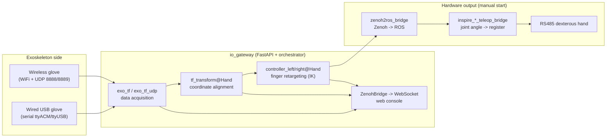

# 01 · Overview

> Audience: All (end users / deployers / developers)

## 1.1 What it is

IO Gesture (the `io_exotrans2hand` **gateway**) is a teleoperation platform that maps hand motions from an **exoskeleton data glove** onto **dexterous hand hardware** in real time. It ships as a self-contained runtime (bundle) plus a web console. Core responsibilities:

- Auto-discover and connect exoskeleton gloves (**wired USB serial** or **wireless WiFi/UDP**)
- Convert exoskeleton pose through coordinate alignment and finger retargeting into target dexterous-hand joint commands in real time
- Distribute data over the Zenoh bus and provide a web console for device connection, hand-model orchestration, status monitoring and 3D visualization
- Send control commands to dexterous-hand hardware (via standalone RS485 bridge scripts)

The platform bundles its own Python 3.10, ROS Humble components and all dependencies under `bundle/`, so it **does not depend on the system Python** and runs out of the box.

## 1.2 System architecture

The **left half (exoskeleton to gateway) is orchestrated automatically**; the **right half (Zenoh to ROS to RS485) must be started manually** (see [06 Teleop & Hardware Bridge](./06-teleop-and-bridge.md)).

## 1.3 End-to-end data flow

| Stage | Component | Input | Output (Zenoh key) | Rate |
|-------|-----------|-------|--------------------|------|
| 1 Acquire | `exo_tf_comm` / `exo_tf_udp_comm` | serial / UDP raw data | `io_fusion/tf_exoskeleton`, `io_esk/joint_data` | ~120 Hz |
| 2 Align | `tf_transform_comm` | `io_fusion/tf_exoskeleton` | `io_align/<Hand>/tf_hand` | 100 Hz |
| 3 Retarget | `control_v2_3_zenoh` | `io_align/<Hand>/tf_hand` | `io_teleop/<Hand>/joint_cmd_finger_left/right` | 100 Hz |
| 4 Distribute | ZenohBridge / WebSocket | above keys | web 3D, live charts | configurable |
| 5 Output | `*_teleop_bridge.py` | ROS `JointState` | RS485 registers | on command arrival |

Acquisition rate and topics are in `configs/config/topics.yaml` (`timer_frequency: 120`); alignment/retargeting rates are the `rate` fields in each hand's `tf_transform_v2.yml` and `controller_v2_3_*.yml`.

## 1.4 Three typical usage modes

- **Head (default)**: web console + 3D visualization, for on-site operation and debugging.
- **Headless**: REST API + WebSocket only, for SSH / systemd / integration.
- **Pure teleop chain**: gateway handles the software chain (exoskeleton to joint commands); hardware output is handled by the `Inspire_Hardware_Bridge/` scripts.

## 1.5 Glossary

| Term | Meaning |
|------|---------|
| gateway | The main program `io_gateway`, a FastAPI service for orchestration, Zenoh bridge and web console |
| bundle | Prebuilt self-contained runtime (Python / ROS / deps / binaries) under `bundle/` |
| exo | Data glove capturing hand pose; wired (serial) or wireless (UDP) |
| hand | The full config package of one dexterous hand, under `configs/end_tools/<HandName>/` |
| topology | Currently connected exoskeleton side: `none` / `left` / `right` / `both` |
| Orchestrator | Internal component that starts/stops subprocesses by topology and hand |
| transform | Alignment subprocess `tf_transform_comm`, produces aligned hand TF |
| controller | Retargeting subprocess `control_v2_3_zenoh`, produces joint commands |
| bridge | RS485 hardware-output script `inspire_*_teleop_bridge.py` |
| Zenoh | Distributed pub/sub bus, the gateway's internal data plane |
| provision | ESP-Touch wireless provisioning; broadcasts WiFi credentials to a device |
| return_ip | The **router/gateway address** entered during provisioning (not this PC's IP) |

## 1.6 Next

- First deployment: [02 Installation & Startup](./02-install-and-startup.md)
- Daily operation: [03 Web Console](./03-web-console.md)
- Problems: [08 Troubleshooting](./08-troubleshooting.md)
