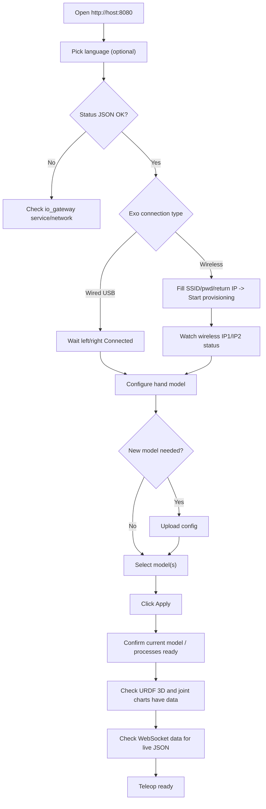

# 03 · Web Console

> Audience: End users

URL: `http://<host>:8080/` (locally `http://127.0.0.1:8080/`). The console is a single-page app with a **two-column + bottom monitor** layout: left "Exoskeleton", right "Dexterous Hand", bottom "System Monitor".

## 3.1 Panel overview

```text
┌───────────────────────── Header: title / version / zh-en switch ──────────────────────┐
├──────────────── Exoskeleton ────────────────┬──────────────── Dexterous Hand ─────────┤
│ Device connection                            │ Model configuration                      │
│  · Wired status (left/right ports)           │  · Current model                         │
│  · Wireless status (IP1/IP2)                 │  · Multi-select + Apply                   │
│  · Wireless provisioning (SSID/pwd/return IP)│  · Upload config                         │
│ Exoskeleton visualization                    │ Hand visualization                       │
│  · URDF 3D / joint / rate / vibration charts │  · Model picker / URDF 3D / joint / rate │
├──────────────────────────────── System Monitor ──────────────────────────────────────┤
│  · Status (JSON snapshot)         · WebSocket data (pick a stream, latest frame)        │
└────────────────────────────────────────────────────────────────────────────────────────┘
```

`[placeholder: screenshot - full console]`

### Header
- Title + version (e.g. V2.0.2), tagline
- **Language switch**: zh / EN, stored in browser `localStorage`

### Exoskeleton · Device connection
| Sub-panel | Purpose |
|-----------|---------|
| Wired status | Shows left/right serial ports; badge Connected / Not connected |
| Wireless status | Up to 2 online IPs (IP1/IP2) and Waiting / Receiving |
| Wireless provisioning | ESP-Touch form: SSID, password, return IP; `?` popover for help |

### Exoskeleton · Visualization
URDF 3D model follows motion; left/right joint-angle curves; output rate (Hz) chart; 10-channel vibration feedback bars.

### Dexterous Hand · Model configuration
| Sub-panel | Purpose |
|-----------|---------|
| Current model | Applied model; may show "saved, waiting for exo" / "processes not ready" |
| Model selection | Multi-select checkboxes + Apply; applying with none selected clears models |
| Upload config | Drag-drop / pick an archive or model root folder; validated then uploaded |

### Dexterous Hand · Visualization
Model dropdown (only **applied** models) then URDF 3D preview; left/right joint & rate charts (source is IK commands, not measured).

### System Monitor
- **Status**: live JSON snapshot; a yellow banner appears when offline
- **WebSocket data**: pick a stream, show its latest JSON frame

## 3.2 Full operation flow



### Step 0: Open the console
Open the gateway URL, optionally switch language, and confirm "System Monitor to Status" turns from "loading" into JSON. If you see "Cannot reach gateway", check the service (see [08](./08-troubleshooting.md)).

### Step 1: Connect the exoskeleton
- **Wired**: connect left/right gloves via USB; the status shows ports + Connected.
- **Wireless**: fill SSID / password (>=8) / return IP (**router address**), then Start provisioning, and watch IP1/IP2 become "Receiving data". See [04](./04-devices-and-provisioning.md).

### Step 2: Configure the hand model
1. Check the current-model badge (see 3.3).
2. If the model is missing, upload it (layout in [05](./05-hand-models.md)).
3. Select model(s) (multi-select), then click **Apply**.
4. Applying with nothing selected asks: "Clear applied models and stop transform/controller?"

### Step 3: Verify visualization and data
Exoskeleton/hand URDF follows motion; joint charts have curves and rate is non-zero; the WebSocket panel shows the latest JSON for a selected stream.

### Step 4: Ready checklist
| Check | Expected |
|-------|----------|
| Status `exo.topology` | `left` / `right` / `both` (not `none`) |
| Exo connection | Connected, or wireless IP "Receiving data" |
| `active_hands` | Matches selected models |
| `processes` | `transform@Model`, `controller_*` are `running` |
| Current model | No "processes not ready" suffix |
| URDF / joint charts | Have live data |

## 3.3 Current-model badges

| Display | Meaning |
|---------|---------|
| `None` | No model applied |
| `Model (saved, waiting for exo)` | Config written, but exo not ready |
| `Model (processes not ready)` | Applied but transform not running |
| Model name only | Ready |

## 3.4 Button to API mapping

| Action | Element | HTTP method & path |
|--------|---------|--------------------|
| Page load (auto) | — | `GET /api/v1/wifi/config`, `/hands/configs`, `/hands/dirs`, `/streams`, `/status` |
| Status polling (1s) | — | `GET /api/v1/status` |
| Refresh model list | refresh icon | `GET /api/v1/hands/configs` |
| Apply model | Apply | `POST /api/v1/hands/select` body `{hands:[...]}` |
| Upload model | Upload config | `POST /api/v1/hands/configs/upload` (multipart, confirm overwrite on 409) |
| Start provisioning | Start provisioning | `POST /api/v1/wifi/provision` |
| Save network | Save network | `PUT /api/v1/wifi/config` |
| Visualization load | auto | `GET /api/v1/visualization/config`, `/visualization/urdf/exo`, `/visualization/urdf/{hand}` |
| Data plane | auto connect | `WS /ws` |

> **Note**: the UI still contains legacy strings like "Start/Stop UDP receiver" (`btn.udpExoStart/Stop`), but there is **no such button** on the current page and no matching REST endpoint. Wireless UDP receiving is **orchestrated automatically** by the gateway (provision to heartbeat online to auto-probe/start).

## 3.5 WebSocket data plane `/ws`

- Connected on page load; after connecting it auto-`subscribe`s a trimmed set: `io_esk.joint_data`, left/right `imu`, `io_esk.vibration_feedback`, and the applied model's `io_teleop.joint_cmd_left/right.<hand>`.
- Push format: `{stream, data}`; the terminal caches the latest frame per stream.
- Auto-reconnect (exponential backoff 1s-30s) with a "reconnecting" notice.
- Full stream catalog: `GET /api/v1/streams`.

## 3.6 Common UI messages (zh/en)

| Scenario | 中文 | English |
|----------|------|---------|
| Gateway offline | 无法连接网关，请确认 io_gateway 已启动 | Cannot reach gateway — ensure io_gateway is running |
| Recovered | 已恢复与网关的连接 | Connection to gateway restored |
| Missing SSID | 请填写 SSID | SSID is required |
| Password too short | 密码至少 {min} 位 | Password must be at least {min} characters |
| Provision success | 配网信息广播成功 | Provisioning broadcast successful |
| No online device | 未检测到在线设备 | No online device detected |
| Waiting for exo | 等待连接外骨骼手套 | Waiting for exoskeleton glove connection |
| Receiving | 数据接收中... | Receiving data... |
| Clear confirm | 未勾选型号。是否清除已应用的型号并停止 transform / controller？ | No model selected. Clear applied models and stop transform / controller? |

---

Next: [04 Devices & Provisioning](./04-devices-and-provisioning.md)
