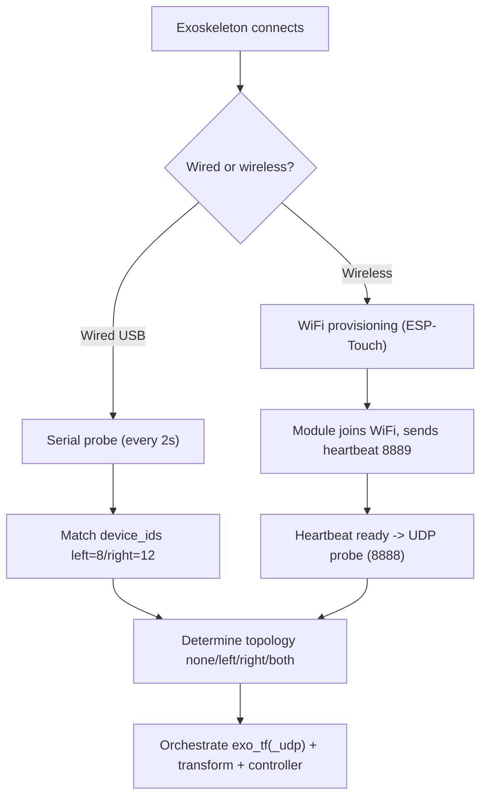

# 04 · Devices & Provisioning

> Audience: End users / Deployers

The exoskeleton connects in two ways: **wired (USB serial)** and **wireless (WiFi + UDP)**. The gateway orchestrates the downstream processes based on what is connected.



## 4.1 Wired (serial)

### Mechanism
1. Poll serial every `probe_interval_sec` (default 2s).
2. Scan `/dev/ttyACM*`, `/dev/ttyUSB*`, excluding `probe_exclude_ports`.
3. Read device ID and compare with `device_ids`: `left=8`, `right=12`.
4. A layout change requires `layout_confirm_count` (default 2) consistent rounds (debounce).
5. Keep the bound topology until `serial_probe_fail_threshold` (default 2) consecutive failures.
6. While `exo_tf` runs it does not grab the serial port; `GET /api/v1/probe` reads the runtime cache.

### Config (`configs/config/gateway.yaml`)
| Key | Meaning |
|-----|---------|
| `probe_interval_sec` | Serial poll interval (s), default 2.0 |
| `layout_confirm_count` | Debounce confirm count, default 2 |
| `serial_probe_fail_threshold` | Keep bound topology until N failures, default 2 |
| `probe_exclude_ports` | Ports never probed (put dexterous-hand RS485 ports here) |
| `device_ids.left / right` | Exoskeleton device IDs (left/right) |

> **Important**: dexterous-hand RS485 ports (e.g. `/dev/ttyUSB0`, `/dev/ttyUSB1`) should be added to `probe_exclude_ports` so the exoskeleton probe does not grab them.

### Operation
Plug in the left/right gloves via USB, the console "Wired status" shows ports + Connected, and `exo.topology` in the status JSON becomes `left`/`right`/`both`.

## 4.2 Wireless (UDP + heartbeat)

Two stages:

**Stage A — heartbeat (port 8889)**: after joining the network, the module sends heartbeats; the gateway derives `online_ips` and `ready_ips`; `alive_timeout_ms` (default 3000) marks offline.

**Stage B — UDP probe (port 8888)**: listen at `udp_probe.bind_ip:port` (default `10.42.0.2:8888`) for `listen_ms` (1000ms), parse frames and identify left/right by `device_ids`; `require_local_network: true` requires an address in that subnet on this host.

Config (`configs/config/gateway.yaml`):
```yaml
udp_probe:
  bind_ip: 10.42.0.2
  port: 8888
  listen_ms: 1000
  probe_retries: 2
  retry_gap_sec: 1.0
  fail_threshold: 3
  require_local_network: true
wifi_heartbeat:
  port: 8889
  bind_ip: ""            # empty = 0.0.0.0
  alive_timeout_ms: 3000
  scan_listen_ms: 2000
udp_allowed_ips: []       # IP whitelist, up to 2; used when ready>2
```

> Wireless UDP receiving is **orchestrated automatically**: when serial has no device and heartbeat is ready, the gateway auto-probes and starts `exo_tf_udp`. **No manual "Start UDP" click is needed.**
>
> **Serial precedence**: plugging in a wired exoskeleton preempts UDP mode and stops `exo_tf_udp`.

## 4.3 WiFi provisioning (ESP-Touch)

A wireless module must first be "provisioned" — broadcasting the target WiFi SSID / password / return IP to the device.

### Prerequisites (must all hold)
1. **This PC is connected to the target WiFi** (correct SSID/password).
2. **Return IP = router/gateway address** (e.g. `10.42.0.1`), **not this PC's IP**.
3. **You can ping that gateway** (ESP-Touch needs the router MAC).
4. Password length 8-128.

Defaults (`configs/config/gateway.yaml`):
```yaml
wifi_provision:
  ssid: IO_2.4G_LSFWN
  password: minnanoIO
  return_ip: 10.42.0.1
```

### Operation
1. Fill SSID, password, return IP in "Wireless provisioning".
2. Optionally "Save network" (`PUT /api/v1/wifi/config`, writes gateway.yaml, prefilled next time).
3. Click "Start provisioning" (`POST /api/v1/wifi/provision`).
4. Success shows "Provisioning broadcast successful"; then watch IP1/IP2.

### How it works (brief)
`get_router_mac(return_ip)` obtains the gateway MAC, encodes SSID/password/return IP, and UDP-broadcasts ESP-Touch guide and data codes (blocking a few seconds in a thread pool).

## 4.4 Provisioning troubleshooting

Typical error (in `logs/<date>/io_gateway.log`):
```
配网失败: 无法获取路由器在 10.42.0.1 的 MAC 地址，请检查连接。
(Provisioning failed: cannot get router MAC at 10.42.0.1, check the connection.)
```

| Cause | Fix |
|-------|-----|
| Not on the target WiFi | Connect the correct SSID first |
| Return IP set to this PC's IP | Use the **gateway address** (e.g. 10.42.0.1) |
| Gateway not pingable, no ARP entry | `ping <return_ip>` first, then provision |
| Password < 8 chars | Use 8-128 chars |
| Clicking repeatedly | Diagnose each failure first, don't spam |

### Quick self-check
After connecting the target WiFi:
```bash
# 1. Confirm connected WiFi
nmcli -t -f ACTIVE,SSID dev wifi | grep '^yes'
# 2. Confirm default gateway
ip route | grep default
# 3. Confirm ping and MAC resolution
ping -c 2 <return_ip> && ip neigh show <return_ip>
```
All three OK then provision. See [08 Troubleshooting](./08-troubleshooting.md).

## 4.5 API quick reference

```bash
# Re-probe now (serial or UDP by current mode)
curl http://127.0.0.1:8080/api/v1/probe

# Wireless heartbeat online devices
curl http://127.0.0.1:8080/api/v1/wifi/heartbeat/devices

# Provision
curl -X POST http://127.0.0.1:8080/api/v1/wifi/provision \
  -H 'Content-Type: application/json' \
  -d '{"ssid":"IO_2.4G_LSFWN","password":"minnanoIO","return_ip":"10.42.0.1"}'
```

---

Next: [05 Hand Models](./05-hand-models.md)
