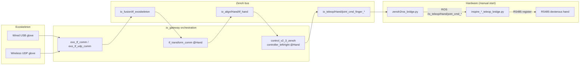

# 06 · Teleop & Hardware Bridge

> Audience: Developers / Deployers

The gateway's software chain ends at the Zenoh joint commands `io_teleop/<Hand>/joint_cmd_finger_left|right`. To actually drive the dexterous hand you must **start the RS485 bridge script manually**; the bridge subscribes ROS topics via `rclpy`, so you usually also need to bridge Zenoh data into ROS topics first.

## 6.1 End-to-end data flow



| Stage | Component | Output key | Rate |
|-------|-----------|------------|------|
| Acquire | `exo_tf_comm` / `exo_tf_udp_comm` | `io_fusion/tf_exoskeleton`, `io_esk/joint_data` | ~120 Hz |
| Align | `tf_transform_comm` | `io_align/<Hand>/tf_hand` | 100 Hz |
| Retarget | `control_v2_3_zenoh` | `io_teleop/<Hand>/joint_cmd_finger_left/right` | 100 Hz |
| Output | `*_teleop_bridge.py` | RS485 registers | on command arrival |

## 6.2 Bridge scripts

In `scripts/Inspire_Hardware_Bridge/`:

| Script | Hand | DOF | Register protocol |
|--------|------|-----|-------------------|
| `inspire_rh56f2_teleop_bridge.py` | `Inspire_RH56F2` | 6 cylinders | angleSet @ 1040 |
| `inspire_rh5dg2_teleop_bridge.py` | `Inspire_RH5DG2` | 13 DOF | angleSet @ 1080 |
| `inspire_rh56e2_teleop_bridge.py` | `Inspire_RH56E2` (no package) | 6 | Setpos @ 0x05C2 |
| `Inspire_RH5DG2_control_node.py` | legacy single-process | 13 DOF | topic name mismatch, see below |

### Subscribed topics (defaults)
The three `*_teleop_bridge.py` default to (matching the gateway namespace):
```text
/io_teleop/<HandName>/joint_cmd_finger_left
/io_teleop/<HandName>/joint_cmd_finger_right
```

> **Note**: `Inspire_RH5DG2_control_node.py` subscribes `/io_teleop/RH5DG2/joint_cmd_finger_{side}`, which **does not match** the gateway's actual `/io_teleop/Inspire_RH5DG2/...`. Prefer `inspire_rh5dg2_teleop_bridge.py`.

## 6.3 Joint angle to register mapping (principle)

Each finger is computed by "sum joint angles to normalize to [0,1] to linear map to register range", then written to the angleSet/Setpos register over RS485 (frame header `0xEB 0x90`). Example (RH56F2):

| Cylinder | Joint | rad range | register range |
|----------|-------|-----------|----------------|
| 1 Pinky | `pinky_1_joint` | [0, 1.47] | [1740, 900] |
| 5 Thumb Flex | `thumb_2_joint` | [0, 0.79] | [1450, 1100] |
| 6 Thumb Abd | `thumb_1_joint` | [0, 2.0] | [1750, 500] |

Init registers on start: RH56F2 writes mode(1100)/speed(1052)/force(1046); RH5DG2 writes angleSet(1080)/speed(0x0454)/force(1093), defaults `init_speed=2500`, `init_force=1000`.

## 6.4 Launch parameters

Common ROS params for `*_teleop_bridge.py`:

| Param | Default | Meaning |
|-------|---------|---------|
| `right_input_topic` / `left_input_topic` | `/io_teleop/<Hand>/joint_cmd_finger_*` | Subscribed topic |
| `right_joint_prefix` / `left_joint_prefix` | `right_` / `left_` | JointState.name prefix |
| `right_serial_port` / `left_serial_port` | `/dev/ttyUSB0` / `/dev/ttyUSB1` | RS485 port |
| `baud_rate` | `115200` | Baud rate |
| `right_hand_id` / `left_hand_id` | `1` | RS485 slave ID |
| `enable_right_hand` / `enable_left_hand` | `true` | Which side enabled |
| `init_hand_on_start` | `true` | Write speed/force/mode at start |
| `log_mapped_positions` | `false` | Print mapped angles |
| `log_serial` | `false` | Print raw serial frames |

RH5DG2 extra: `init_speed`(2500), `init_force`(1000), `angle_write_settle_ms`(6), `generic_post_write_ms`(25).

## 6.5 Run steps

**Prereq**: terminal A already ran `./scripts/run_gateway.sh`; the dexterous-hand serial ports are in `probe_exclude_ports` in `gateway.yaml`.

### Step 1: Zenoh to ROS bridge (terminal B)
The bridge uses ROS topics, so convert Zenoh data to ROS first. See `tools/zenoh2ros使用说明.md`:
```bash
cd {root}
source /opt/ros/humble/setup.bash          # adjust to your ROS version
python3 tools/zenoh2ros_bridge.py           # see the tool doc for args
```

### Step 2: Hardware bridge (terminal C)
```bash
cd {root}
source /opt/ros/humble/setup.bash

# RH56F2 dual
python3 scripts/Inspire_Hardware_Bridge/inspire_rh56f2_teleop_bridge.py --ros-args \
  -p right_serial_port:=/dev/ttyUSB0 \
  -p left_serial_port:=/dev/ttyUSB1 \
  -p baud_rate:=115200 \
  -p log_mapped_positions:=true

# RH5DG2 dual (force 1000 / speed 2500)
python3 scripts/Inspire_Hardware_Bridge/inspire_rh5dg2_teleop_bridge.py --ros-args \
  -p right_serial_port:=/dev/ttyUSB0 \
  -p left_serial_port:=/dev/ttyUSB1 \
  -p init_speed:=2500 \
  -p init_force:=1000

# Left hand only
python3 scripts/Inspire_Hardware_Bridge/inspire_rh56f2_teleop_bridge.py --ros-args \
  -p enable_right_hand:=false \
  -p left_serial_port:=/dev/ttyUSB0
```

## 6.6 Bring-up checks

1. Gateway: `logs/<date>/transform_<Hand>.log`, `controller_*_<Hand>.log` are clean; console joint charts have data.
2. Bridge: add `-p log_mapped_positions:=true` to watch mapped angles change with hand motion.
3. Hardware: the hand follows; if not, check serial port, `hand_id`, baud rate, `probe_exclude_ports`.

---

Next: [07 Configuration Reference](./07-configuration-reference.md)
