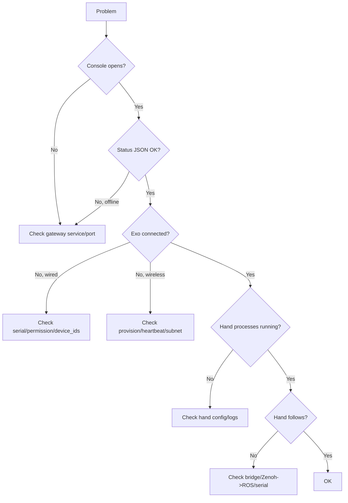

# 08 · Troubleshooting

> Audience: All

## 8.1 Diagnostic overview



## 8.2 Locating logs

```bash
# Main process
tail -f logs/$(date +%Y-%m-%d)/io_gateway.log
# Subprocesses
tail -f logs/$(date +%Y-%m-%d)/exo_tf.log
tail -f logs/$(date +%Y-%m-%d)/exo_tf_udp.log
tail -f logs/$(date +%Y-%m-%d)/transform_<Hand>.log
tail -f logs/$(date +%Y-%m-%d)/controller_left_<Hand>.log
```

## 8.3 Console won't open / status offline

UI shows: **"Cannot reach gateway — ensure io_gateway is running"**.

| Check | Command / method |
|-------|------------------|
| Service running | `curl -s http://127.0.0.1:8080/api/v1/status` |
| Port in use | `ss -ltnp | grep 8080` |
| Port config | `listen_port` in `configs/config/gateway.yaml` |
| URL/port match | If script auto-opens browser, `GATEWAY_PORT` must equal `listen_port` |
| Main log errors | `tail -n 100 logs/<date>/io_gateway.log` |

## 8.4 Wired exoskeleton won't connect

| Symptom | Likely cause | Fix |
|---------|--------------|-----|
| Port shows Not connected | Not plugged / cable issue | Reconnect; `ls /dev/ttyACM* /dev/ttyUSB*` to confirm device |
| Permission denied on open | Not in dialout | Run `./scripts/install-desktop.sh` then **log out/in**; `groups | grep dialout` |
| Device grabbed wrongly | Dexterous-hand serial probed as exo | Add its serial port to `probe_exclude_ports` |
| Left/right swapped | `device_ids` mismatch | Verify `device_ids.left/right` (default 8/12) |
| Topology flapping | Bad contact | Increase `layout_confirm_count`; check cabling |

## 8.5 Wireless / provisioning problems

### Provision failed: cannot get router MAC
Error: `配网失败: 无法获取路由器在 10.42.0.1 的 MAC 地址，请检查连接。`

| Cause | Fix |
|-------|-----|
| Not on the target WiFi | Connect the correct SSID first |
| Return IP set to this PC's IP | Use the **gateway address** (e.g. 10.42.0.1) |
| Gateway not pingable | `ping <return_ip>` first to build ARP, then provision |
| Password < 8 chars | Use 8-128 chars |
| Clicking repeatedly | Diagnose each failure first |

Self-check:
```bash
nmcli -t -f ACTIVE,SSID dev wifi | grep '^yes'   # connected WiFi
ip route | grep default                           # default gateway
ping -c 2 <return_ip> && ip neigh show <return_ip> # can resolve MAC?
```

### Provisioned but module not online
| Check | Notes |
|-------|-------|
| Heartbeat port | Module must send heartbeat to `8889`; `GET /api/v1/wifi/heartbeat/devices` |
| Local subnet | With `require_local_network: true`, host needs a `10.42.x` address (default `10.42.0.2`) |
| UDP probe | `wireless.online_ips` in status JSON; keeps retrying with no device |
| IP whitelist | With non-empty `udp_allowed_ips`, only whitelisted IPs participate |

## 8.6 Hand processes not ready

UI current model shows "(processes not ready)" or "(saved, waiting for exo)".

| Check | Notes |
|-------|-------|
| Exo connected | With no exo, the hand chain doesn't start (topology `none`) |
| transform log | Check `transform_<Hand>.log` for URDF/yml errors |
| controller log | Check `controller_*_<Hand>.log` for `free_joints`/link mismatches |
| Config completeness | 3 yml + `urdf/` present (see [05](./05-hand-models.md)) |
| Re-apply | Re-Apply in the console, or `POST /api/v1/hands/select` |

## 8.7 Dexterous hand not following

Gateway joint charts have data but the real hand doesn't move:

| Check | Notes |
|-------|-------|
| Bridge started | Is `inspire_*_teleop_bridge.py` running (see [06](./06-teleop-and-bridge.md)) |
| Zenoh to ROS bridged | Bridge uses ROS topics; run `tools/zenoh2ros_bridge.py` first |
| Topic name match | Gateway publishes `/io_teleop/<Hand>/joint_cmd_finger_*`; do not use `Inspire_RH5DG2_control_node.py` for RH5DG2 (topic mismatch) |
| Serial params | `serial_port`, `hand_id`, `baud_rate` correct |
| Serial not grabbed | Hand serial must be in `probe_exclude_ports` |
| Mapping check | Add `-p log_mapped_positions:=true` to see angles change |

## 8.8 Quick self-check

```bash
# Gateway health
curl -s http://127.0.0.1:8080/api/v1/status | python3 -m json.tool

# Serial devices
ls -l /dev/ttyACM* /dev/ttyUSB* 2>/dev/null
groups | grep dialout || echo "not in dialout; log out/in required"

# Wireless heartbeat
curl -s http://127.0.0.1:8080/api/v1/wifi/heartbeat/devices

# Re-probe now
curl -s http://127.0.0.1:8080/api/v1/probe
```

---

Next: [09 Developer Guide](./09-developer-guide.md)
