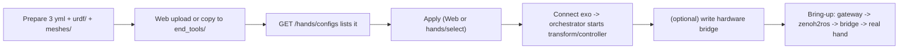

# 09 · Developer Guide

> Audience: Developers

This chapter covers the lightweight development needed for operation: adding a hand model, writing/adapting a hardware bridge script, and a build-script overview. Deeper architectural changes are out of scope.

## 9.1 Add a hand model

### Required files
Under `configs/end_tools/<NewHandName>/`:

1. `tf_transform_v2.yml` — `tf_list` mapping between exoskeleton links and the new hand's URDF links
2. `controller_v2_3_left.yml` / `controller_v2_3_right.yml` — `free_joints`, `task.pose/vector` consistent with the URDF
3. `urdf/<model>.urdf` — with links referenced by tasks (`*_tip`, `*_hand_ee_link`, ...)
4. `meshes/*.STL` — required by upload validation and visualization

Hand-name rule: `^[A-Za-z0-9_]{1,128}$`, and it should match the Zenoh/ROS namespace used by the bridge script.

### Steps


1. **Upload** (web console) or copy manually to `configs/end_tools/<NewHandName>/`.
2. **Validate**: `GET /api/v1/hands/configs` should list the new hand.
3. **Apply**: Web Apply or `POST /api/v1/hands/select` body `{"hands":["NewHandName"]}`; also written to `hand_choose` in `gateway.yaml`.
4. **Connect exoskeleton**: once topology is detected, the orchestrator starts `transform@NewHandName` and controllers.
5. **(Optional) hardware bridge**: see 9.2.
6. **Bring-up**: check `logs/<date>/transform_*.log`, `controller_*.log`.

### Key edits when copying an existing hand
| File | Must change |
|------|-------------|
| `tf_transform_v2.yml` | exo/hand link names and RPY calibration in `tf_list` |
| `controller_v2_3_*.yml` | `model.urdf`, `free_joints`, link names and scale in `task` |
| `urdf/` | joint naming aligned with `free_joints` and bridge `joint_suffix` |
| bridge script | mapping table, register protocol, `<HandName>` in default topics |

## 9.2 Write/adapt a hardware bridge script

Use `scripts/Inspire_Hardware_Bridge/inspire_rh56f2_teleop_bridge.py` (6 DOF) or `inspire_rh5dg2_teleop_bridge.py` (13 DOF) as templates. Three key parts:

### 1) Joint mapping table
Define each finger by "sum joint angles to normalize [0,1] to linear map to register range":
```python
FINGER_MAPPINGS = (
    FingerMapping(('pinky_1_joint',), 1740, 900, 0.0, 1.47),   # (joint, reg@low, reg@high, rad_low, rad_high)
    ...
)
```

### 2) Register protocol (RS485)
Frame header `0xEB 0x90`, write command `0x12`. Addresses differ by model:
| Model | angleSet/Setpos | speed | force |
|-------|-----------------|-------|-------|
| RH56F2 | 1040 | 1052 | 1046 |
| RH5DG2 | 1080 | 0x0454 | 1093 |
| RH56E2 | 0x05C2 (Setpos) | — | — |

### 3) Default subscribed topics
Must match the gateway's publications:
```python
self.declare_parameter('right_input_topic', '/io_teleop/<NewHandName>/joint_cmd_finger_right')
self.declare_parameter('left_input_topic',  '/io_teleop/<NewHandName>/joint_cmd_finger_left')
```

> **Known pitfall**: `Inspire_RH5DG2_control_node.py` (legacy single-process) subscribes `/io_teleop/RH5DG2/...`, which mismatches the gateway's `/io_teleop/Inspire_RH5DG2/...`. Use `*_teleop_bridge.py` as the template with the full hand name.

### Syntax check
```bash
python3 -m py_compile scripts/Inspire_Hardware_Bridge/inspire_<model>_teleop_bridge.py
```

## 9.3 Build scripts (build pipeline only)

The release is prebuilt; operators need not run these. For building from source:

| Script | Purpose | Environment |
|--------|---------|-------------|
| `scripts/cython_build.sh` | Compile `io_gateway` backend to `.so` (`--strip-py` removes the source .py) | Ubuntu 22.04 build container + `python3.10-dev` + `Cython>=3.0` |
| `scripts/gen_protobuf.sh` | Generate C++/Python from `proto/io_msgs/messages.proto` via `protoc` | `bundle/opt/io-deps/bin/protoc` available |
| `scripts/install_protobuf_bundle.sh` | Build libprotobuf + protoc from source into the bundle | Docker build container, needs `PREFIX/SRC/PY_SITE` |

> Note: most `io_gateway.backend` modules are compiled to `.so` (e.g. `main`, `config_loader`, `orchestrator/*`, `glove_manager`, `zenoh/bridge`); their sources are not in the release. Readable sources are limited to a few entries like `main.py`, `api/routes.py`.

## 9.4 Optional debug tools

| Tool | Purpose |
|------|---------|
| `tools/zenoh2ros_bridge.py` | Bridge Zenoh data to ROS2 topics (prerequisite for hardware bridge), see `tools/zenoh2ros使用说明.md` |
| `tools/ws2ros_bridge.py` | Bridge WebSocket data to ROS2 topics |

---

Back: [Manual home](../README.md)
