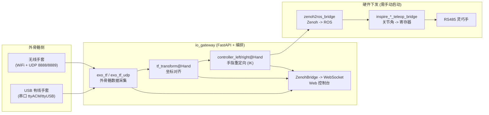

# 01 · 概述

> 适用读者：全部（终端用户 / 部署工程师 / 二次开发者）

## 1.1 产品定位

IO Gesture（`io_exotrans2hand` 网关，简称 **网关 / gateway**）是一套将 **外骨骼数据手套** 的手部动作实时映射到 **灵巧手硬件** 的遥操作平台。它以一个自包含的运行时（bundle）+ Web 控制台的形式交付，核心职责：

- 自动发现并接入外骨骼手套（**有线 USB 串口** 或 **无线 WiFi/UDP**）
- 将外骨骼姿态经坐标对齐、手指重定向，实时算出目标灵巧手关节指令
- 通过 Zenoh 总线分发数据，并提供 Web 控制台进行设备接入、手型编排、状态监视与 3D 可视化
- 向灵巧手硬件下发控制指令（通过独立的 RS485 桥接脚本）

平台自带独立 Python 3.10、ROS Humble 组件与全部依赖（位于 `bundle/`），**不依赖系统 Python 版本**，开箱即用。

## 1.2 系统架构

图中 **实线左半部（外骨骼→网关）由网关自动编排**；**右半部（Zenoh→ROS→RS485）需运维单独启动**（详见 [06 遥操作与硬件桥接](./06-teleop-and-bridge.md)）。

## 1.3 端到端数据流

| 阶段 | 组件 | 输入 | 输出（Zenoh key） | 频率 |
|------|------|------|-------------------|------|
| 1 采集 | `exo_tf_comm` / `exo_tf_udp_comm` | 串口 / UDP 原始数据 | `io_fusion/tf_exoskeleton`、`io_esk/joint_data` 等 | ~120 Hz |
| 2 对齐 | `tf_transform_comm` | `io_fusion/tf_exoskeleton` | `io_align/<Hand>/tf_hand` | 100 Hz |
| 3 重定向 | `control_v2_3_zenoh` | `io_align/<Hand>/tf_hand` | `io_teleop/<Hand>/joint_cmd_finger_left/right` | 100 Hz |
| 4 分发 | ZenohBridge / WebSocket | 上述 keys | Web 3D、实时图表 | 可配置 |
| 5 下发 | `*_teleop_bridge.py` | ROS `JointState` | RS485 寄存器 | 随指令到达 |

采集频率与话题名见 `configs/config/topics.yaml`（`timer_frequency: 120`）；对齐/重定向频率见各手型 `tf_transform_v2.yml` 与 `controller_v2_3_*.yml` 的 `rate` 字段。

## 1.4 三种典型使用形态

- **有界面（head，默认）**：Web 控制台 + 3D 可视化，适合现场操作与调试。
- **无界面（headless）**：仅 REST API + WebSocket，适合 SSH / systemd / 集成场景。
- **纯遥操作链路**：网关负责软件链路（外骨骼→关节指令），硬件下发由 `Inspire_Hardware_Bridge/` 桥接脚本承担。

## 1.5 术语表

| 术语 | 说明 |
|------|------|
| 网关 / gateway | 本项目主程序 `io_gateway`，FastAPI 服务，负责编排、Zenoh 桥、Web 控制台 |
| bundle | 预编译的自包含运行时（Python / ROS / 依赖 / 二进制），位于 `bundle/` |
| 外骨骼 / exo | 数据手套，采集人手姿态，分有线（串口）与无线（UDP）两种接入 |
| 手型 / hand | 一款灵巧手的完整配置包，位于 `configs/end_tools/<HandName>/` |
| 拓扑 / topology | 当前接入的外骨骼侧别：`none` / `left` / `right` / `both` |
| 编排 / Orchestrator | 网关内部组件，按拓扑与手型自动启停子进程 |
| transform | 坐标对齐子进程 `tf_transform_comm`，产出对齐后的手 TF |
| controller | 手指重定向子进程 `control_v2_3_zenoh`，产出关节指令 |
| 桥接 / bridge | RS485 硬件下发脚本 `inspire_*_teleop_bridge.py` |
| Zenoh | 分布式发布/订阅总线，网关内部数据面 |
| 配网 / provision | ESP-Touch 无线配网，向待配网设备广播 WiFi 凭据 |
| 回调 IP / return_ip | 配网时填写的 **路由器/网关地址**（非本机 IP） |

## 1.6 下一步

- 首次部署 → [02 安装与启动](./02-install-and-startup.md)
- 日常操作 → [03 Web 控制台](./03-web-console.md)
- 遇到问题 → [08 故障排查](./08-troubleshooting.md)
