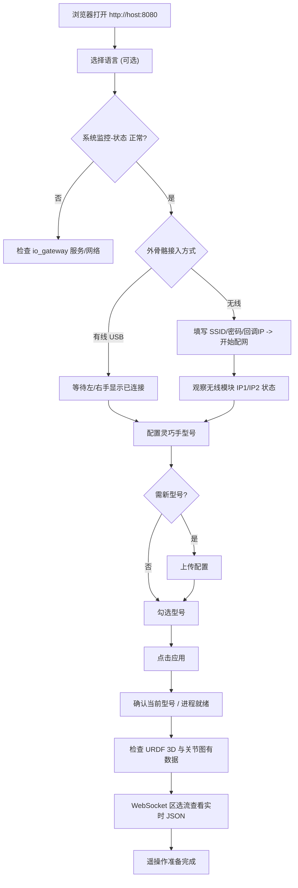

# 03 · Web 控制台

> 适用读者：终端操作用户

访问地址：`http://<主机IP>:8080/`（本机 `http://127.0.0.1:8080/`）。控制台为单页应用，采用 **左右双栏 + 底部监控** 布局：左「外骨骼」、右「灵巧手」、底「系统监控」。

## 3.1 页面区块总览

```text
┌─────────────────────────── 页头：标题 / 版本 / 中英切换 ───────────────────────────┐
├───────────────── 外骨骼 ─────────────────┬───────────────── 灵巧手 ─────────────────┤
│ 设备连接                                  │ 型号配置                                   │
│  · 外骨骼连接状态（有线：左/右手端口）     │  · 当前型号                                │
│  · 无线模块状态（IP1/IP2）                │  · 型号多选 + 应用                         │
│  · 无线模块配网（SSID/密码/回调IP）        │  · 上传配置                                │
│ 外骨骼可视化                              │ 灵巧手可视化                               │
│  · URDF 3D / 关节图 / 频率图 / 振动反馈    │  · 型号下拉 / URDF 3D / 关节图 / 频率图     │
├──────────────────────────────── 系统监控 ────────────────────────────────────────┤
│  · 状态（JSON 快照）          · WebSocket 数据（选流看最新帧）                       │
└──────────────────────────────────────────────────────────────────────────────────┘
```

`[占位：截图 - 控制台整体界面]`

### 页头
- 标题 + 版本号（如 V2.0.2）、副标题
- **语言切换**：中文 / EN，选择写入浏览器 `localStorage`

### 外骨骼 · 设备连接
| 子区块 | 作用 |
|--------|------|
| 外骨骼连接状态（有线） | 显示左/右手串口；徽章「已连接」/「未连接」 |
| 无线模块状态 | 显示最多 2 个在线 IP（IP1/IP2）及「等待/接收中」 |
| 无线模块配网 | ESP-Touch 配网表单：SSID、密码、回调 IP；`?` 气泡为说明 |

### 外骨骼 · 可视化
URDF 3D 模型随动作运动；左/右关节角曲线；输出频率（Hz）图；10 通道振动反馈柱状图。

### 灵巧手 · 型号配置
| 子区块 | 作用 |
|--------|------|
| 当前型号 | 已应用型号；可显示「已保存，等待外骨骼」「进程未就绪」 |
| 型号选择 | 多选复选框 +「应用」；不勾选再应用会清除型号 |
| 上传配置 | 拖放/选择压缩包或型号根文件夹，校验后上传 |

### 灵巧手 · 可视化
型号下拉（仅列**已应用**型号）→ URDF 3D 预览；左右手关节图/频率图（数据源为 IK 指令，非实测）。

### 系统监控
- **状态**：实时 JSON 快照；离线时顶部黄色横幅提示
- **WebSocket 数据**：下拉选流，显示该流最新一帧 JSON

## 3.2 完整操作流程



### 步骤 0：打开控制台
访问网关地址 → 可选切换中英 → 确认「系统监控 → 状态」由「加载中…」变为 JSON。若出现「无法连接网关，请确认 io_gateway 已启动」，先排查服务（见 [08](./08-troubleshooting.md)）。

### 步骤 1：接入外骨骼
- **有线**：USB 连接左右手 → 连接状态显示端口 + 徽章「已连接」。
- **无线**：填写 SSID / 密码（≥8 位）/ 回调 IP（**路由器地址**）→「开始配网」→ 观察 IP1/IP2 变为「数据接收中」。详见 [04](./04-devices-and-provisioning.md)。

### 步骤 2：配置灵巧手型号
1. 查看当前型号状态标识（见 3.3）。
2. 若无所需型号 → 上传（结构见 [05](./05-hand-models.md)）。
3. 勾选型号（可多选）→ 点击 **应用**。
4. 若取消全部勾选后应用，会确认「是否清除已应用型号并停止 transform/controller」。

### 步骤 3：验证可视化与数据流
外骨骼/灵巧手 URDF 有随动；关节图有曲线、频率图非 0 Hz；系统监控 WebSocket 区选流可见最新 JSON。

### 步骤 4：准备完成判定清单
| 检查项 | 期望 |
|--------|------|
| 状态 JSON `exo.topology` | `left` / `right` / `both`（非 `none`） |
| 外骨骼连接 | 已连接，或无线 IP「数据接收中」 |
| `active_hands` | 与所选型号一致 |
| `processes` | `transform@型号`、`controller_*` 为 `running` |
| 当前型号 | 无「进程未就绪」后缀 |
| URDF / 关节图 | 有实时数据 |

## 3.3 当前型号状态标识

| 显示 | 含义 |
|------|------|
| `未选择` | 尚未应用任何型号 |
| `型号名（已保存，等待外骨骼）` | 已写入配置，但外骨骼未就绪 |
| `型号名（进程未就绪）` | 已应用但 transform 未 running |
| 仅显示型号名 | 就绪 |

## 3.4 按钮 → API 映射

| 用户操作 | 元素 | HTTP 方法与路径 |
|----------|------|-----------------|
| 页面加载（自动） | — | `GET /api/v1/wifi/config`、`/hands/configs`、`/hands/dirs`、`/streams`、`/status` |
| 状态轮询（每 1s） | — | `GET /api/v1/status` |
| 刷新型号列表 | 刷新图标 | `GET /api/v1/hands/configs` |
| 应用型号 | 「应用」 | `POST /api/v1/hands/select`  body `{hands:[...]}` |
| 上传型号 | 「上传配置」 | `POST /api/v1/hands/configs/upload`（multipart，409 时确认覆盖） |
| 开始配网 | 「开始配网」 | `POST /api/v1/wifi/provision` |
| 保存网络 | 「保存网络」 | `PUT /api/v1/wifi/config` |
| 可视化加载 | 自动 | `GET /api/v1/visualization/config`、`/visualization/urdf/exo`、`/visualization/urdf/{hand}` |
| 数据面 | 自动连接 | `WS /ws` |

> **说明**：界面文案中存在「启动 UDP 接收 / 停止 UDP 接收」（`btn.udpExoStart/Stop`）等遗留字符串，但当前页面 **无该按钮**，也无对应 REST 接口。无线 UDP 接收由网关后台 **自动编排**（配网 → 心跳在线 → 自动探测启动），无需手动点击。

## 3.5 WebSocket 数据面 `/ws`

- 页面加载即连接；连接后自动 `subscribe` 一组精简流：`io_esk.joint_data`、左右 `imu`、`io_esk.vibration_feedback`、以及已应用型号的 `io_teleop.joint_cmd_left/right.<hand>`。
- 推送格式：`{stream, data}`；终端区缓存每流最新一帧。
- 断线自动重连（指数退避 1s–30s），并显示「连接断开，正在重连…」。
- 全量流目录见 `GET /api/v1/streams`。

## 3.6 常见界面提示（中英对照摘选）

| 场景 | 中文 | English |
|------|------|---------|
| 网关离线 | 无法连接网关，请确认 io_gateway 已启动 | Cannot reach gateway — ensure io_gateway is running |
| 恢复连接 | 已恢复与网关的连接 | Connection to gateway restored |
| 配网缺 SSID | 请填写 SSID | SSID is required |
| 密码过短 | 密码至少 {min} 位 | Password must be at least {min} characters |
| 配网成功 | 配网信息广播成功 | Provisioning broadcast successful |
| 无在线设备 | 未检测到在线设备 | No online device detected |
| 等待外骨骼 | 等待连接外骨骼手套 | Waiting for exoskeleton glove connection |
| 数据接收 | 数据接收中... | Receiving data... |
| 清除型号确认 | 未勾选型号。是否清除已应用的型号并停止 transform / controller？ | No model selected. Clear applied models and stop transform / controller? |

---

下一步：[04 设备接入与配网](./04-devices-and-provisioning.md)
