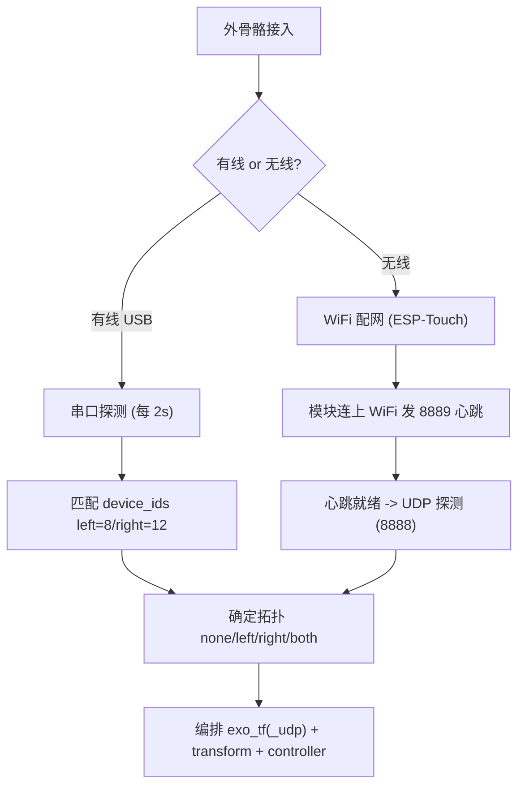

# 04 · 设备接入与配网

> 适用读者：终端用户 / 部署工程师

外骨骼有两种接入方式：**有线（USB 串口）** 与 **无线（WiFi + UDP）**。网关会根据实际接入自动编排后续进程。



## 4.1 有线接入（串口）

### 机制
1. 每 `probe_interval_sec`（默认 2s）轮询串口。
2. 扫描 `/dev/ttyACM*`、`/dev/ttyUSB*`，排除 `probe_exclude_ports`。
3. 读取设备 ID 与 `device_ids` 比对：`left=8`、`right=12`。
4. 布局变化需连续 `layout_confirm_count`（默认 2）轮一致才触发编排（防抖）。
5. 连续探测失败 `serial_probe_fail_threshold`（默认 2）次前，保留已绑定拓扑。
6. `exo_tf` 运行时不再抢占串口；`GET /api/v1/probe` 读运行时缓存。

### 相关配置（`configs/config/gateway.yaml`）
| 配置项 | 含义 |
|--------|------|
| `probe_interval_sec` | 串口轮询间隔（秒），默认 2.0 |
| `layout_confirm_count` | 布局变化防抖确认次数，默认 2 |
| `serial_probe_fail_threshold` | 失败 N 次前保留已绑定拓扑，默认 2 |
| `probe_exclude_ports` | 永不探测的串口（如灵巧手 ACM/USB 口） |
| `device_ids.left / right` | 外骨骼设备 ID（区分左右手） |

> **重要**：灵巧手的 RS485 串口（如 `/dev/ttyUSB0`、`/dev/ttyUSB1`）应加入 `probe_exclude_ports`，避免被外骨骼探测误占用。

### 操作
USB 插入左右手手套 → 控制台「外骨骼连接状态」显示端口 + 徽章「已连接」→ 状态 JSON 的 `exo.topology` 变为 `left`/`right`/`both`。

## 4.2 无线接入（UDP + 心跳）

无线为两阶段：

**阶段 A — 心跳（端口 8889）**：模块联网后向网关发心跳，网关据此得出在线 IP（`online_ips`）与就绪 IP（`ready_ips`）；`alive_timeout_ms`（默认 3000）判离线。

**阶段 B — UDP 设备探测（端口 8888）**：在 `udp_probe.bind_ip:port`（默认 `10.42.0.2:8888`）监听 `listen_ms`（1000ms），解析帧并按 `device_ids` 识别左右；`require_local_network: true` 要求本机存在该网段地址。

配置（`configs/config/gateway.yaml`）：
```yaml
udp_probe:
  bind_ip: 10.42.0.2
  port: 8888
  listen_ms: 1000
  probe_retries: 2
  retry_gap_sec: 1.0
  fail_threshold: 3
  require_local_network: true
wifi_heartbeat:
  port: 8889
  bind_ip: ""            # 空 = 0.0.0.0
  alive_timeout_ms: 3000
  scan_listen_ms: 2000
udp_allowed_ips: []       # IP 白名单，最多 2 个；ready>2 时参与筛选
```

> 无线 UDP 接收由网关 **自动编排**：串口无设备且心跳就绪时，自动 UDP 探测并启动 `exo_tf_udp`。**控制台无需手动点「启动 UDP」**。
>
> **串口优先**：插入有线外骨骼会抢占 UDP 模式，自动停止 `exo_tf_udp`。

## 4.3 WiFi 配网（ESP-Touch）

无线模块首次使用需先「配网」——把目标 WiFi 的 SSID / 密码 / 回调 IP 广播给待配网设备。

### 前置条件（务必满足）
1. **本机已连接目标 WiFi**（SSID / 密码正确）。
2. **回调 IP = 路由器/网关地址**（如 `10.42.0.1`），**不是本机 IP**。
3. **能 ping 通该网关**（ESP-Touch 需先获取路由器 MAC）。
4. 密码长度 8–128 位。

默认参数（`configs/config/gateway.yaml`）：
```yaml
wifi_provision:
  ssid: IO_2.4G_LSFWN
  password: minnanoIO
  return_ip: 10.42.0.1
```

### 操作
1. 控制台「无线模块配网」填写 SSID、密码、回调 IP。
2. 可选「保存网络」（`PUT /api/v1/wifi/config`，写入 gateway.yaml，下次自动填充）。
3. 点击「开始配网」（`POST /api/v1/wifi/provision`）。
4. 成功提示「配网信息广播成功」；随后观察无线模块 IP1/IP2 状态。

### 工作原理（简述）
`get_router_mac(return_ip)` 取网关 MAC → 编码 SSID/密码/回调 IP → UDP 广播 ESP-Touch 引导码与数据码（在线程池阻塞数秒）。

## 4.4 配网失败排查

典型错误（见 `logs/<date>/io_gateway.log`）：
```
配网失败: 无法获取路由器在 10.42.0.1 的 MAC 地址，请检查连接。
```

| 原因 | 处理 |
|------|------|
| 未连目标 WiFi（连了别的网络） | 先连接正确 SSID |
| 回调 IP 填成本机 IP | 改为 **网关地址**（如 10.42.0.1） |
| 未 ping 通网关，ARP 无记录 | 先 `ping <return_ip>` 建立 ARP，再配网 |
| 密码少于 8 位 | 前后端均校验拒绝 |
| 短时间狂点按钮 | 每次失败先排查，勿连续重试 |

### 快速自检命令
连上目标 WiFi 后执行：
```bash
# 1. 确认已连目标 WiFi
nmcli -t -f ACTIVE,SSID dev wifi | grep '^yes'
# 2. 确认默认网关
ip route | grep default
# 3. 确认能 ping 通并解析 MAC
ping -c 2 <return_ip> && ip neigh show <return_ip>
```
三条正常后再配网。更多见 [08 故障排查](./08-troubleshooting.md)。

## 4.5 API 速查

```bash
# 立即重探测（串口或 UDP，取决于当前模式）
curl http://127.0.0.1:8080/api/v1/probe

# 无线心跳在线设备
curl http://127.0.0.1:8080/api/v1/wifi/heartbeat/devices

# 配网
curl -X POST http://127.0.0.1:8080/api/v1/wifi/provision \
  -H 'Content-Type: application/json' \
  -d '{"ssid":"IO_2.4G_LSFWN","password":"minnanoIO","return_ip":"10.42.0.1"}'
```

---

下一步：[05 手型配置](./05-hand-models.md)
