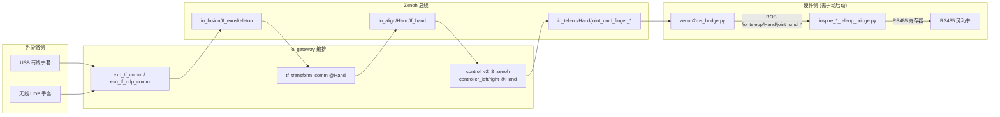

# 06 · 遥操作与硬件桥接

> 适用读者：二次开发者 / 部署工程师

网关的软件链路止于 Zenoh 上的关节指令 `io_teleop/<Hand>/joint_cmd_finger_left|right`。要真正驱动灵巧手，还需 **手动启动 RS485 桥接脚本**；桥接脚本用 ROS2 `rclpy` 订阅 ROS 话题，因此通常还需先把 Zenoh 数据桥接为 ROS 话题。

## 6.1 端到端数据流



| 阶段 | 组件 | 输出 key | 频率 |
|------|------|----------|------|
| 采集 | `exo_tf_comm` / `exo_tf_udp_comm` | `io_fusion/tf_exoskeleton`、`io_esk/joint_data` | ~120 Hz |
| 对齐 | `tf_transform_comm` | `io_align/<Hand>/tf_hand` | 100 Hz |
| 重定向 | `control_v2_3_zenoh` | `io_teleop/<Hand>/joint_cmd_finger_left/right` | 100 Hz |
| 下发 | `*_teleop_bridge.py` | RS485 寄存器 | 随指令到达 |

## 6.2 桥接脚本一览

位于 `scripts/Inspire_Hardware_Bridge/`：

| 脚本 | 对应手型 | 自由度 | 寄存器协议 |
|------|----------|--------|-----------|
| `inspire_rh56f2_teleop_bridge.py` | `Inspire_RH56F2` | 6 电缸 | angleSet @ 1040 |
| `inspire_rh5dg2_teleop_bridge.py` | `Inspire_RH5DG2` | 13 DOF | angleSet @ 1080 |
| `inspire_rh56e2_teleop_bridge.py` | `Inspire_RH56E2`（无配置包） | 6 路 | Setpos @ 0x05C2 |
| `Inspire_RH5DG2_control_node.py` | 旧版单进程 | 13 DOF | 话题名不一致，见下 |

### 订阅话题（默认）
三份 `*_teleop_bridge.py` 默认订阅（与网关命名空间一致）：
```text
/io_teleop/<HandName>/joint_cmd_finger_left
/io_teleop/<HandName>/joint_cmd_finger_right
```

> **注意**：`Inspire_RH5DG2_control_node.py` 订阅的是 `/io_teleop/RH5DG2/joint_cmd_finger_{side}`，与网关实际发布的 `/io_teleop/Inspire_RH5DG2/...` **不一致**。运维请优先使用 `inspire_rh5dg2_teleop_bridge.py`。

## 6.3 关节角 → 寄存器映射（原理）

每路手指按「关节角求和 → 归一化到 [0,1] → 线性映射到寄存器范围」计算，再经 RS485（帧头 `0xEB 0x90`）写入 angleSet/Setpos 寄存器。示例（RH56F2）：

| 电缸 | 关节 | rad 范围 | 寄存器范围 |
|------|------|----------|-----------|
| 1 Pinky | `pinky_1_joint` | [0, 1.47] | [1740, 900] |
| 5 Thumb Flex | `thumb_2_joint` | [0, 0.79] | [1450, 1100] |
| 6 Thumb Abd | `thumb_1_joint` | [0, 2.0] | [1750, 500] |

启动时初始化寄存器：RH56F2 写 mode(1100)/speed(1052)/force(1046)；RH5DG2 写 angleSet(1080)/speed(0x0454)/force(1093)，默认 `init_speed=2500`、`init_force=1000`。

## 6.4 启动参数

`*_teleop_bridge.py` 通用 ROS 参数：

| 参数 | 默认 | 说明 |
|------|------|------|
| `right_input_topic` / `left_input_topic` | `/io_teleop/<Hand>/joint_cmd_finger_*` | 订阅话题 |
| `right_joint_prefix` / `left_joint_prefix` | `right_` / `left_` | JointState.name 前缀 |
| `right_serial_port` / `left_serial_port` | `/dev/ttyUSB0` / `/dev/ttyUSB1` | RS485 串口 |
| `baud_rate` | `115200` | 波特率 |
| `right_hand_id` / `left_hand_id` | `1` | RS485 从站 ID |
| `enable_right_hand` / `enable_left_hand` | `true` | 启用哪侧 |
| `init_hand_on_start` | `true` | 启动时写 speed/force/mode |
| `log_mapped_positions` | `false` | 打印映射后角度 |
| `log_serial` | `false` | 打印原始串口帧 |

RH5DG2 额外：`init_speed`(2500)、`init_force`(1000)、`angle_write_settle_ms`(6)、`generic_post_write_ms`(25)。

## 6.5 运行步骤

**前提**：终端 A 已 `./scripts/run_gateway.sh`；灵巧手串口已加入 `gateway.yaml` 的 `probe_exclude_ports`（避免被外骨骼探测误占）。

### 第 1 步：Zenoh → ROS 桥接（终端 B）
桥接脚本走 ROS 话题，需先把 Zenoh 数据转为 ROS。参考 `tools/zenoh2ros使用说明.md`：
```bash
cd {root}
source /opt/ros/humble/setup.bash          # 按本机 ROS 版本调整
python3 tools/zenoh2ros_bridge.py           # 具体参数见该工具说明
```

### 第 2 步：硬件桥接（终端 C）
```bash
cd {root}
source /opt/ros/humble/setup.bash

# RH56F2 双手
python3 scripts/Inspire_Hardware_Bridge/inspire_rh56f2_teleop_bridge.py --ros-args \
  -p right_serial_port:=/dev/ttyUSB0 \
  -p left_serial_port:=/dev/ttyUSB1 \
  -p baud_rate:=115200 \
  -p log_mapped_positions:=true

# RH5DG2 双手（受力 1000 / 速度 2500）
python3 scripts/Inspire_Hardware_Bridge/inspire_rh5dg2_teleop_bridge.py --ros-args \
  -p right_serial_port:=/dev/ttyUSB0 \
  -p left_serial_port:=/dev/ttyUSB1 \
  -p init_speed:=2500 \
  -p init_force:=1000

# 仅左手示例
python3 scripts/Inspire_Hardware_Bridge/inspire_rh56f2_teleop_bridge.py --ros-args \
  -p enable_right_hand:=false \
  -p left_serial_port:=/dev/ttyUSB0
```

## 6.6 联调检查

1. 网关侧：`logs/<date>/transform_<Hand>.log`、`controller_*_<Hand>.log` 无报错，控制台关节图有数据。
2. 桥接侧：加 `-p log_mapped_positions:=true` 观察映射角度随手部动作变化。
3. 硬件侧：灵巧手随动；若无响应，检查串口号、`hand_id`、波特率、`probe_exclude_ports`。

---

下一步：[07 配置参考](./07-configuration-reference.md)
