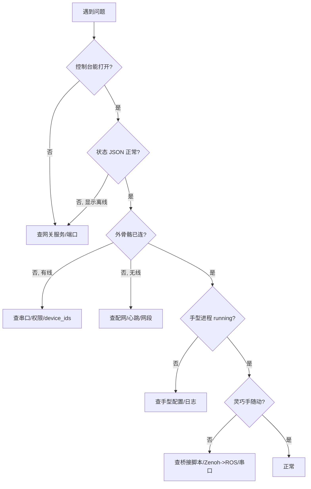

# 08 · 故障排查

> 适用读者：全部

## 8.1 排障总览



## 8.2 日志定位

```bash
# 主进程
tail -f logs/$(date +%Y-%m-%d)/io_gateway.log
# 子进程
tail -f logs/$(date +%Y-%m-%d)/exo_tf.log
tail -f logs/$(date +%Y-%m-%d)/exo_tf_udp.log
tail -f logs/$(date +%Y-%m-%d)/transform_<Hand>.log
tail -f logs/$(date +%Y-%m-%d)/controller_left_<Hand>.log
```

## 8.3 控制台无法打开 / 状态离线

界面提示：**「无法连接网关，请确认 io_gateway 已启动」**。

| 检查 | 命令 / 方法 |
|------|-------------|
| 服务是否在跑 | `curl -s http://127.0.0.1:8080/api/v1/status` |
| 端口是否被占 | `ss -ltnp | grep 8080` |
| 端口配置 | `configs/config/gateway.yaml` 的 `listen_port` |
| 浏览器 URL 与端口一致 | 若用脚本自动开浏览器，`GATEWAY_PORT` 须与 `listen_port` 一致 |
| 主日志报错 | `tail -n 100 logs/<date>/io_gateway.log` |

## 8.4 有线外骨骼连不上

| 现象 | 可能原因 | 处理 |
|------|----------|------|
| 端口显示未连接 | 未插好 / 线缆问题 | 重插，`ls /dev/ttyACM* /dev/ttyUSB*` 确认设备存在 |
| 打开串口权限不足 | 不在 dialout 组 | `./scripts/install-desktop.sh` 后 **注销重登**；`groups | grep dialout` |
| 设备被误占 | 灵巧手串口被当外骨骼探测 | 把灵巧手串口加入 `probe_exclude_ports` |
| 左右识别错乱 | `device_ids` 不匹配 | 核对 `device_ids.left/right`（默认 8/12） |
| 拓扑抖动 | 接触不良 | 提高 `layout_confirm_count`；检查连接 |

## 8.5 无线外骨骼 / 配网问题

### 配网失败：无法获取路由器 MAC
错误：`配网失败: 无法获取路由器在 10.42.0.1 的 MAC 地址，请检查连接。`

| 原因 | 处理 |
|------|------|
| 未连目标 WiFi | 先连接正确 SSID |
| 回调 IP 填成本机 IP | 改为 **网关地址**（如 10.42.0.1） |
| 未 ping 通网关 | 先 `ping <return_ip>` 建立 ARP 再配网 |
| 密码 <8 位 | 使用 8–128 位密码 |
| 连续狂点 | 每次失败先排查，勿连点 |

自检：
```bash
nmcli -t -f ACTIVE,SSID dev wifi | grep '^yes'   # 已连的 WiFi
ip route | grep default                           # 默认网关
ping -c 2 <return_ip> && ip neigh show <return_ip> # 能否解析 MAC
```

### 配网成功但模块不上线
| 检查 | 说明 |
|------|------|
| 心跳端口 | 模块需向本机 `8889` 发心跳；`GET /api/v1/wifi/heartbeat/devices` 查在线 IP |
| 本机网段 | `require_local_network: true` 时本机须有 `10.42.x` 地址（默认 `10.42.0.2`） |
| UDP 探测 | 状态 JSON 的 `wireless.online_ips`；无设备时探测持续重试 |
| IP 白名单 | `udp_allowed_ips` 非空时仅白名单参与 |

## 8.6 手型进程未就绪

界面：当前型号显示「（进程未就绪）」或「（已保存，等待外骨骼）」。

| 检查 | 说明 |
|------|------|
| 是否已接外骨骼 | 无外骨骼时不启动手型链（拓扑为 `none`） |
| transform 日志 | `transform_<Hand>.log` 是否报 URDF/yml 错误 |
| controller 日志 | `controller_*_<Hand>.log` 是否报 `free_joints`/link 名不匹配 |
| 手型配置完整性 | 3 个 yml + `urdf/` 是否齐全（见 [05](./05-hand-models.md)） |
| 重新应用 | 控制台重新「应用」，或 `POST /api/v1/hands/select` |

## 8.7 灵巧手不随动

网关侧关节图有数据，但实手不动：

| 检查 | 说明 |
|------|------|
| 桥接脚本已启动 | `inspire_*_teleop_bridge.py` 是否运行（见 [06](./06-teleop-and-bridge.md)） |
| Zenoh→ROS 已桥接 | 桥接脚本走 ROS 话题，需先跑 `tools/zenoh2ros_bridge.py` |
| 话题名一致 | 网关发 `/io_teleop/<Hand>/joint_cmd_finger_*`；RH5DG2 勿用 `Inspire_RH5DG2_control_node.py`（话题名不符） |
| 串口参数 | `serial_port`、`hand_id`、`baud_rate` 是否正确 |
| 串口未被占 | 灵巧手串口须在 `probe_exclude_ports` |
| 映射验证 | 加 `-p log_mapped_positions:=true` 看角度是否变化 |

## 8.8 快速自检脚本

```bash
# 网关健康
curl -s http://127.0.0.1:8080/api/v1/status | python3 -m json.tool

# 串口设备
ls -l /dev/ttyACM* /dev/ttyUSB* 2>/dev/null
groups | grep dialout || echo "不在 dialout 组，需注销重登"

# 无线心跳
curl -s http://127.0.0.1:8080/api/v1/wifi/heartbeat/devices

# 立即重探测
curl -s http://127.0.0.1:8080/api/v1/probe
```

---

下一步：[09 二次开发指南](./09-developer-guide.md)
